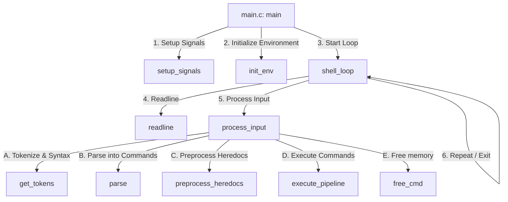
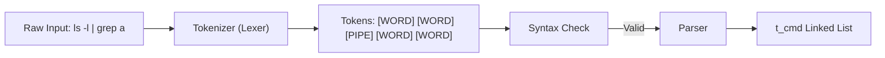
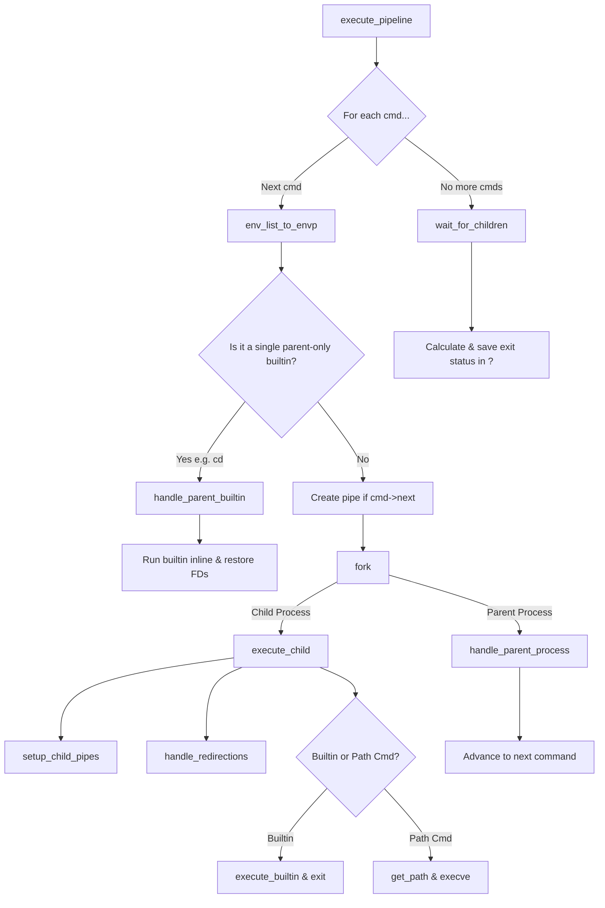

# Minishell Flow & Architecture Guide

This document maps out the architecture and lifecycle of your Minishell. It details how everything works and explains the step-by-step function call chain.

---

## 🗺️ High-Level Architecture Flow

---

## 🚦 Phase 1: Boot Sequence
When you start `./minishell`, the program goes through a boot sequence to establish signal behavior and memory structures.

1. **`main`** ([main.c](file:///home/mwei/42Projects/mini_sub/src/main.c#L101))
   * Calls **`setup_signals`** ([signals/signals.c]) to configure how the parent shell handles `Ctrl+C` (re-prompt) and `Ctrl+\` (ignore).
   * Calls **`init_env(envp)`** ([env/env_init.c]) to duplicate the system environment variables into a dynamic singly linked list (`t_env`).
   * Calls **`shell_loop(&env_list)`** ([main.c](file:///home/mwei/42Projects/mini_sub/src/main.c#L77)) to enter the primary interaction loop.

---

## 🔄 Phase 2: The Shell Loop
The shell loop continuously waits for, reads, and dispatches command inputs.

1. **`shell_loop`** ([main.c](file:///home/mwei/42Projects/mini_sub/src/main.c#L77))
   * Calls **`readline("Minishell>$ ")`** to block and wait for input.
     * *If input is NULL:* User pressed `Ctrl+D` (EOF). Breaks the loop, runs cleanup, and terminates.
   * Calls **`process_input(input, env_list)`** ([main.c](file:///home/mwei/42Projects/mini_sub/src/main.c#L48)) if there is text.
   * Frees the `input` string, loops around.

---

## 🧩 Phase 3: Tokenizing & Parsing
Before a command can execute, raw text is transformed into tokens, validated for syntax, and structured into a executable command chain (`t_cmd`).

1. **`get_tokens`** ([main.c](file:///home/mwei/42Projects/mini_sub/src/main.c#L33))
   * Calls **`tokenizer`** ([lexer/lexer.c](file:///home/mwei/42Projects/mini_sub/src/lexer/lexer.c#L93)) to traverse the input character-by-character.
     * Depending on characters, it calls **`handle_word`**, **`handle_heredoc`**, or **`handle_operator`** to construct a `t_token` list.
     * Variable expansion (like `$USER` or `$?`) happens inline inside `handle_word` using **`fill_word`** / **`expand_variable`**.
   * Calls **`syntax_check`** ([parse/parse_utils2.c](file:///home/mwei/42Projects/mini_sub/src/parse/parse_utils2.c#L48)) to ensure there are no grammar issues (like `cat | |`, or ending a line with a trailing redirection).
2. **`parse`** ([parse/parsing.c](file:///home/mwei/42Projects/mini_sub/src/parse/parsing.c#L99))
   * Receives the `t_token` list and builds the `t_cmd` singly linked list.
   * Allocates an argument array (`argv`) using **`count_cmd_args`**.
   * Loops through tokens via **`handle_token`**:
     * **`WORD`**: Copies string into `argv` via `ft_strdup`.
     * **`REDIR_IN` / `REDIR_OUT` / `APPEND` / `HEREDOC`**: Calls **`handle_redir`** to set the `input_file`, `output_file`, or `heredoc` on the current command node.
     * **`PIPE`**: Calls **`handle_pipe_case`** to initialize a new `t_cmd` node and link it as `current->next`.

---

## 📝 Phase 4: Heredoc Pre-processing
Bash rules state that all heredocs must be collected *before* any execution begins.

1. **`preprocess_heredocs`** ([execution/heredoc.c](file:///home/mwei/42Projects/mini_sub/src/execution/heredoc.c#L73))
   * Loops through all `t_cmd` nodes. If a command contains a heredoc delimiter, it calls:
   * **`process_heredoc`** ([execution/heredoc.c](file:///home/mwei/42Projects/mini_sub/src/execution/heredoc.c#L45)):
     * Creates an in-memory communication channel via **`pipe(fd)`**.
     * Sets **`rl_event_hook = &heredoc_sig_check`** so that hitting `Ctrl+C` immediately breaks the blocking `readline("> ")` loop.
     * Opens a `readline("> ")` loop to collect user lines.
     * For each line: calls **`write_line_to_pipe`** which expands variables via **`expand_heredoc_line`** and writes the output to the write-end (`fd[1]`).
     * Closes `fd[1]` (the write-end) and returns `fd[0]` (the read-end), which is saved in `cmd->heredoc_fd`.

---

## ⚙️ Phase 5: The Execution Engine
This is the core execution block managed by `execute_pipeline`.

### Detailed Execution Functions

1. **`execute_pipeline`** ([execution/execute.c](file:///home/mwei/42Projects/mini_sub/src/execution/execute.c#L127))
   * Traverses your command linked list. For each command, it calls:
   * **`execute_single_cmd`** ([execution/execute.c](file:///home/mwei/42Projects/mini_sub/src/execution/execute.c#L99)):
     * Converts `t_env` to `char **envp` via **`env_list_to_envp`** for OS compatibility.
     * Calls **`handle_parent_builtin`**:
       * *If command is a single builtin (like `cd`, `export`, `exit`) and NOT part of a pipeline:*
         * Backs up standard input/output (`dup`).
         * Redirects input/output files via **`handle_redirections`**.
         * Runs **`execute_builtin`** directly in the parent process.
         * Restores standard input/output (`dup2`) and cleans up `envp`.
       * *Otherwise (it is an external command or part of a pipe):*
         * Creates a pipe (`pipe(p)`) if there is a next command.
         * Calls `fork()` to spawn a child process.

2. **`execute_child`** (In the Child Process)
   * Resets signals back to default (`SIG_DFL`) so the child can be killed.
   * Calls **`setup_child_pipes`** ([execution/execute_utils.c](file:///home/mwei/42Projects/mini_sub/src/execution/execute_utils.c#L66)):
     * Redirects `STDIN` to read from the previous pipe (`p[2]`) if it exists.
     * Redirects `STDOUT` to write into the current pipe write-end (`p[1]`) if a next command exists.
   * Calls **`handle_redirections`** ([execution/redirections.c](file:///home/mwei/42Projects/mini_sub/src/execution/redirections.c#L84)) to overwrite input/output streams with files or heredocs.
   * Calls **`execute_builtin`** if it's a builtin, then exits.
   * Calls **`get_path`** and **`run_path_cmd`** to look up the executable path in the `PATH` environment variable and call `execve`.

3. **`handle_parent_process`** (In the Parent Process)
   * Closes the read-end of the previous pipe (`p[2]`) to avoid resource leaks.
   * Moves the read-end of the current pipe (`p[0]`) into the previous pipe slot (`p[2]`) so the *next* command in the pipeline can read from it.
   * Closes the write-end of the current pipe (`p[1]`).

4. **`wait_for_children`** ([execution/execute_utils.c](file:///home/mwei/42Projects/mini_sub/src/execution/execute_utils.c#L38))
   * Runs after the command traversal is complete.
   * Ignores signals (`SIGINT`, `SIGQUIT`) so the parent doesn't die while waiting.
   * Calls **`waitpid(last_pid, &status, 0)`** to block until the last child finishes.
     * Checks if it exited normally (`WIFEXITED`) or was terminated by a signal (`WIFSIGNALED`).
     * Calculates the final status (adds `128` to signal numbers for kills).
   * Calls **`waitpid(-1, NULL, 0)`** in a loop to clean up all other processes in the pipeline (preventing zombie processes).
   * Calls **`update_exit_status`** to write the final exit code into the `?` environment variable.

---

## 🛠️ The 3-Integer Pipe Array Trick (`p[3]`)
Standard pipelines are piped using a 2-integer array `fd[2]`. To run arbitrary length pipelines (e.g. `cmd1 | cmd2 | cmd3 | cmd4`), your codebase implements a clever **3-integer pipe array `p[3]`**:

* **`p[0]`** = Read end of the *current* pipe.
* **`p[1]`** = Write end of the *current* pipe.
* **`p[2]`** = Read end of the *previous* pipe (what the last command wrote to).

This creates a relay race:
1. `cmd1` writes to `p[1]`.
2. The parent process shifts `p[0]` into `p[2]`.
3. `cmd2` reads from `p[2]` (which was `cmd1`'s output) and writes to a new `p[1]`.
4. This pattern repeats infinitely, requiring only a single, simple array to manage pipes of any depth.
