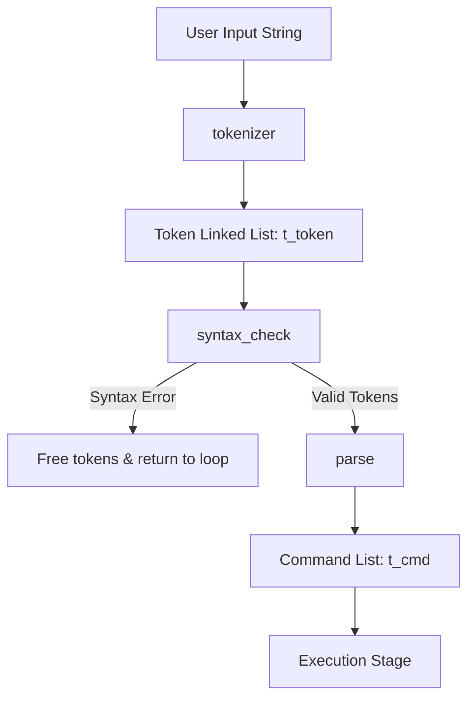

# Minishell Parsing Flow & Architecture Documentation

This document explains in detail how the parsing stage of Minishell functions. It outlines the data structures, step-by-step control flow, function calls, quote handling, environment variable expansions, syntax error checking, and Command AST list construction.

---

## 1. High-Level Architecture Overview

The Minishell parser takes a raw user input string (from `readline`) and converts it into a structured command pipeline. This is accomplished in two distinct phases:

1. **Lexical Analysis (Tokenization & Expansion):** Reads the input string, identifies individual tokens (like words, operators, pipes, and redirections), performs variable expansion (e.g., replacing `$VAR` with its value) and quote removal, and produces a linked list of [t_token](file:///home/mwei/42Projects/mini_sub/includes/minishell.h#L49) structures.
2. **Syntactic & Semantic Analysis (Parsing):** Validates the token sequence for grammar/syntax correctness, and then maps the tokens into a linked list of [t_cmd](file:///home/mwei/42Projects/mini_sub/includes/minishell.h#L56) structures. Each `t_cmd` represents a command block in a pipeline containing arguments, input/output redirections, and heredoc configurations.



---

## 2. Key Data Structures

All data structures are defined in [minishell.h](file:///home/mwei/42Projects/mini_sub/includes/minishell.h).

### A. Token Types ([t_token_type](file:///home/mwei/42Projects/mini_sub/includes/minishell.h#L39))
An enumeration designating the lexical role of a token:
```c
typedef enum e_token_type
{
    WORD,       // Command names, arguments, files, etc.
    PIPE,       // '|'
    REDIR_IN,   // '<'
    REDIR_OUT,  // '>'
    APPEND,     // '>>'
    HEREDOC     // '<<'
}   t_token_type;
```

### B. Tokens List Node ([t_token](file:///home/mwei/42Projects/mini_sub/includes/minishell.h#L49))
Nodes in the linked list produced by the lexer:
```c
typedef struct s_token
{
    char            *value; // Token contents (literal, expanded or file path)
    t_token_type    type;   // Type identifier
    struct s_token  *next;  // Pointer to the next token
}   t_token;
```

### C. Commands List Node ([t_cmd](file:///home/mwei/42Projects/mini_sub/includes/minishell.h#L56))
Nodes in the command pipeline representing individual processes:
```c
typedef struct s_cmd
{
    char            **argv;        // NULL-terminated array of arguments (e.g., {"ls", "-la", NULL})
    char            *input_file;   // Name of the input redirection file (from '<'), or NULL
    char            *output_file;  // Name of the output redirection file (from '>' or '>>'), or NULL
    int             append;        // 1 if output is append mode ('>>'), 0 if truncate mode ('>')
    char            *heredoc;      // Delimiter string of heredoc ('<<'), or NULL
    int             heredoc_fd;    // Read-end of the pipe holding heredoc contents, or -1
    struct s_cmd    *next;         // Pointer to next command in the pipeline
}   t_cmd;
```

### D. Word Parser State ([t_word](file:///home/mwei/42Projects/mini_sub/includes/minishell.h#L67))
A helper structure used to track states during expansion and quote removal:
```c
typedef struct s_word
{
    char            *str;         // Buffer containing the token value being assembled
    char            quote_state;  // Active quote character (0, '\'', or '"')
    int             k;            // Index into the str buffer
    int             has_quotes;   // Flag indicating if quotes were present and removed
    t_env           *env_list;    // Pointer to environment variables list
}   t_word;
```

---

## 3. Detailed Step-by-Step Flow of Control

When the user enters a command, [shell_loop](file:///home/mwei/42Projects/mini_sub/src/main.c#L77) catches the line and runs the parsing cycle.

### Step 3.1: Entry Point
1. **[shell_loop](file:///home/mwei/42Projects/mini_sub/src/main.c#L77)** calls `readline("Minishell>$ ")`. If input exists and isn't empty, it invokes **[process_input](file:///home/mwei/42Projects/mini_sub/src/main.c#L48)**.
2. **[process_input](file:///home/mwei/42Projects/mini_sub/src/main.c#L48)** does the orchestration:
   - Call **[get_tokens](file:///home/mwei/42Projects/mini_sub/src/main.c#L33)** to lex, expand, and syntax check the input.
   - Call **[parse](file:///home/mwei/42Projects/mini_sub/src/parse/parsing.c#L99)** to translate tokens into `t_cmd`.
   - Frees tokens with **[ft_listclear](file:///home/mwei/42Projects/mini_sub/src/utils/utils.c)**.
   - Proceeds to heredoc preprocessing and execution.

---

### Step 3.2: Tokenization & Lexing Flow

Inside **[get_tokens](file:///home/mwei/42Projects/mini_sub/src/main.c#L33)**:
1. Calls **[tokenizer](file:///home/mwei/42Projects/mini_sub/src/lexer/lexer.c#L99)**.
2. **[tokenizer](file:///home/mwei/42Projects/mini_sub/src/lexer/lexer.c#L99)** loops through the input line character-by-character:
   - Skips spaces and tab characters.
   - Checks if the current character matches a special operator using **[types](file:///home/mwei/42Projects/mini_sub/src/parse/parse_utils2.c#L64)** (characters like `|`, `<`, `>`).
   - **Case 1: Word ([handle_word](file:///home/mwei/42Projects/mini_sub/src/lexer/lexer.c#L75))**
     - Initiates a [t_word](file:///home/mwei/42Projects/mini_sub/includes/minishell.h#L67) structure.
     - Calls **[fill_word](file:///home/mwei/42Projects/mini_sub/src/lexer/lexer_utils.c#L100)** to extract characters.
     - Inserts the extracted word into the token list as `WORD`.
   - **Case 2: Heredoc Operator ([handle_heredoc](file:///home/mwei/42Projects/mini_sub/src/lexer/lexer.c#L47))**
     - Invoked when seeing `<<`.
     - Advances index by 2.
     - Skips spaces.
     - Reads alphanumeric and underscore characters representing the heredoc delimiter.
     - Stores the delimiter string as the token's value and sets the type to `HEREDOC`.
   - **Case 3: Other Operator ([handle_operator](file:///home/mwei/42Projects/mini_sub/src/lexer/lexer.c#L32))**
     - Invoked when seeing `<`, `>`, `>>`, or `|`.
     - Determines the operator type (`REDIR_IN`, `REDIR_OUT`, `APPEND`, or `PIPE`).
     - Allocates a token, adds it to the list, and advances index.
3. If tokenization succeeds, calls **[syntax_check](file:///home/mwei/42Projects/mini_sub/src/parse/parse_utils2.c#L43)**.
   - If an error is found, frees all tokens, prints a message, and returns `NULL`.

---

### Step 3.3: Word Processing & Variables Expansion

Within **[fill_word](file:///home/mwei/42Projects/mini_sub/src/lexer/lexer_utils.c#L100)**:
It reads characters from `line` until it encounters an unquoted separator:
- **Quote Toggling:**
  - If `quote_state` is 0 and it encounters `'` or `"`, `quote_state` is set to that quote character, and `has_quotes` is set to 1.
  - If `quote_state` matches the current character, `quote_state` is reset to 0, and `has_quotes` is set to 1.
  - *Effect:* The quote characters themselves are skipped (Quote Removal).
- **Variable Expansion:**
  - If it encounters `$` and `quote_state` is NOT `'` (variables expand inside double quotes and when unquoted):
    - **Exit Code expansion:** If `$?` is found, **[expand_exit_status](file:///home/mwei/42Projects/mini_sub/src/lexer/lexer_utils.c#L37)** fetches the shell's last exit code (represented by `"?"` in the env list), reallocates the buffer via **[realloc_word_buffer](file:///home/mwei/42Projects/mini_sub/src/lexer/lexer_utils.c#L15)**, and writes the status integer as a string.
    - **Environment Variable expansion:** Otherwise, it calls **[expand_variable](file:///home/mwei/42Projects/mini_sub/src/lexer/lexer_utils.c#L77)**:
      - **[extract_varname](file:///home/mwei/42Projects/mini_sub/src/lexer/lexer_utils.c#L55)** parses the variable name (alphanumeric characters and `_` after `$`).
      - If a variable name is found, it calls `get_env_val(env_list, var_name)`.
      - Reallocates the string buffer to fit the expanded value, then copies it.
- **Literal Copy:**
  - In all other cases, characters are copied directly into the `str` buffer.

---

### Step 3.4: Syntax Validation

Before creating command nodes, **[syntax_check](file:///home/mwei/42Projects/mini_sub/src/parse/parse_utils2.c#L43)** validates the grammar:
- If first token is a `PIPE` (`|`), prints `syntax error near unexpected token '|'`.
- Loops through all tokens and calls **[check_tokens](file:///home/mwei/42Projects/mini_sub/src/parse/parse_utils2.c#L15)**:
  - If token is `PIPE` and next is `NULL`: Prints `syntax error near unexpected token 'newline'`.
  - If token is `PIPE` and next is `PIPE`: Prints `syntax error near unexpected token '|'`.
  - If token is a redirection operator (`REDIR_IN`, `REDIR_OUT`, `APPEND`) and next is `NULL`: Prints `syntax error near unexpected token 'newline'`.
  - If token is a redirection operator and next is NOT a `WORD`: Prints `syntax error near unexpected token 'TOKEN_SYMBOL'`.

---

### Step 3.5: AST / Command List Creation

If validation passes, **[parse](file:///home/mwei/42Projects/mini_sub/src/parse/parsing.c#L99)** builds the pipeline struct:
1. Calls **[init_cmd](file:///home/mwei/42Projects/mini_sub/src/parse/parse_utils1.c#L65)** to allocate a `t_cmd` node.
2. Calls **[count_cmd_args](file:///home/mwei/42Projects/mini_sub/src/parse/parse_utils1.c#L39)** on tokens list up to the next `PIPE` to count how many `WORD` tokens will become arguments.
3. Allocates `argv` array based on that count.
4. Traverses tokens:
   - **If Token is `WORD`:** Copies the value to `argv[i]`, increments `i`, moves to `next`.
   - **If Token is Redirection (`REDIR_IN`, `REDIR_OUT`, `APPEND`):** Calls **[handle_redir](file:///home/mwei/42Projects/mini_sub/src/parse/parsing.c#L45)**:
     - Calls **[set_redir_file](file:///home/mwei/42Projects/mini_sub/src/parse/parsing.c#L35)**. It frees any existing file string in that redirection slot and copies `token->next->value` (the file name).
     - Advances the token traversal pointer by two positions (skipping the operator and filename).
     - For `APPEND`, sets `append = 1`.
   - **If Token is `HEREDOC` (`<<`):** Calls **[handle_redir](file:///home/mwei/42Projects/mini_sub/src/parse/parsing.c#L45)**:
     - Copies the token's value (which is already the delimiter name extracted in the lexer) into `cmd->heredoc`.
     - Advances the token traversal pointer by one.
   - **If Token is `PIPE` (`|`):** Calls **[handle_pipe_case](file:///home/mwei/42Projects/mini_sub/src/parse/parsing.c#L15)**:
     - Null-terminates current command's argv: `current->argv[i] = NULL`.
     - Instantiates a new command block: `current->next = init_cmd()`.
     - Counts command arguments for this new command block and allocates its `argv`.
     - Resets index `i = 0`.
     - Moves current command pointer to the new node.
5. Null-terminates the last command block's argv.
6. Returns `head_cmd` to the main flow.

---

## 4. Visualizing a Parsing Transformation

Let's trace how the parser processes:
`echo "hello $USER" > outfile | grep hello`

### Phase 1: Tokens List Generation
The tokenizer reads characters, performs expansions, removes quotes, and produces this linked list of `t_token` nodes:

| Token Index | Token Type | Value | Context |
| :--- | :--- | :--- | :--- |
| **0** | `WORD` | `"echo"` | Command name |
| **1** | `WORD` | `"hello mwei"` | Expanded variable `$USER` inside quotes |
| **2** | `REDIR_OUT` | `NULL` | Redirection operator `>` |
| **3** | `WORD` | `"outfile"` | Redirection filename |
| **4** | `PIPE` | `NULL` | Pipe operator `\|` |
| **5** | `WORD` | `"grep"` | Next command name |
| **6** | `WORD` | `"hello"` | Command argument |

### Phase 2: Command List Construction
The parser builds two `t_cmd` nodes linked together:

```
[ t_cmd Node 1 ]
  ├── argv = {"echo", "hello mwei", NULL}
  ├── input_file = NULL
  ├── output_file = "outfile"
  ├── append = 0
  ├── heredoc = NULL
  └── next ─────────────────────────────────────► [ t_cmd Node 2 ]
                                                    ├── argv = {"grep", "hello", NULL}
                                                    ├── input_file = NULL
                                                    ├── output_file = NULL
                                                    ├── append = 0
                                                    ├── heredoc = NULL
                                                    └── next = NULL
```
